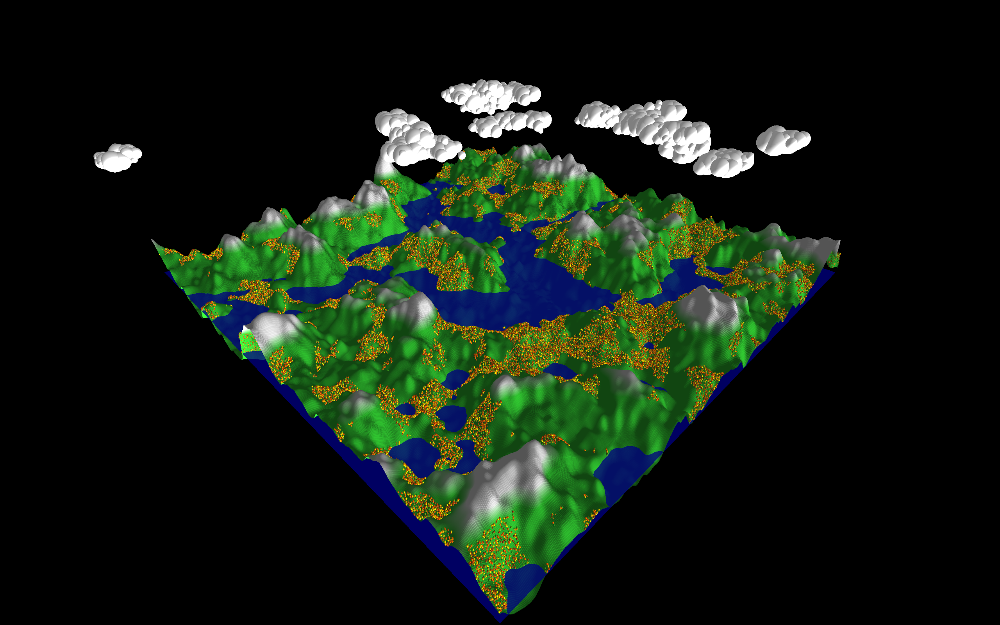

# 3D World in Processing

This project showcases a procedurally generated 3D environment created using Processing's P3D mode. It includes dynamic terrain, trees, clouds, and water bodies, all rendered in real-time.

## Features

- **Procedurally Generated Terrain:** The terrain is generated using Perlin noise, creating a natural and organic landscape with valleys, hills, and rocky mountains. Different terrain heights dictate water bodies, grassy areas, and rocky formations.

- **Trees with Foliage:** The world features trees that are procedurally placed using noise-based density maps, with each tree rendered in 3D with a trunk and a cone-shaped foliage that varies in color to mimic autumn foliage.

- **Dynamic Clouds:** The sky contains procedurally placed clouds, formed using clusters of spheres to create fluffy, natural-looking shapes.

- **Water Bodies:** Bodies of water are placed at lower elevations, creating lakes and other water features that blend naturally into the terrain.

- **Lighting and Camera Setup:** A dynamic lighting system enhances the 3D effect of the terrain and objects. The camera provides a smooth, immersive view of the world.

- **Fully Extensible:** The world and its objects are managed through an object-oriented design, making it easy to add new types of world objects by extending base classes like `WorldObject`.

## Example Render

Here’s an example render of the world:

## Code Overview

### Procedural Generation

- **Perlin Noise:** The terrain is generated using Perlin noise to simulate natural, organic patterns. Clouds and tree placement also use noise to create varying densities across the world.

- **Noise-Based Object Placement:** Trees and clouds are placed based on noise thresholds to create realistic clusters like forests and cloud formations, with some randomness for variation.

- **Height-Based Shading:** The terrain's height determines the color shading between grass, rocks, and water, adding to the realism of the landscape.

### Object-Oriented Structure

The project is built around an extensible object-oriented structure. The `World` class manages terrain generation, object placement, and rendering, while specific world objects like trees and clouds are managed as instances of the `WorldObject` class.

### Customizability

- **Color Scheme:** The project features a `ColorScheme` interface that allows for easy customization of colors for terrain, trees, clouds, and water.

- **World Configuration:** The terrain and objects adapt to parameters defined in the `WorldConfiguration` interface, such as water levels and rock formations.

## Future Plans

- **Improving Realism:** Future iterations will focus on refining terrain generation for more diverse biomes and smoother transitions.
- **Exploration of Procedurally Generated World:** Implementing a system to allow players to explore the procedurally generated world, potentially with additional interactions.
- **Performance Optimization:** As the world grows larger, optimizations will be made to keep rendering smooth and efficient.
